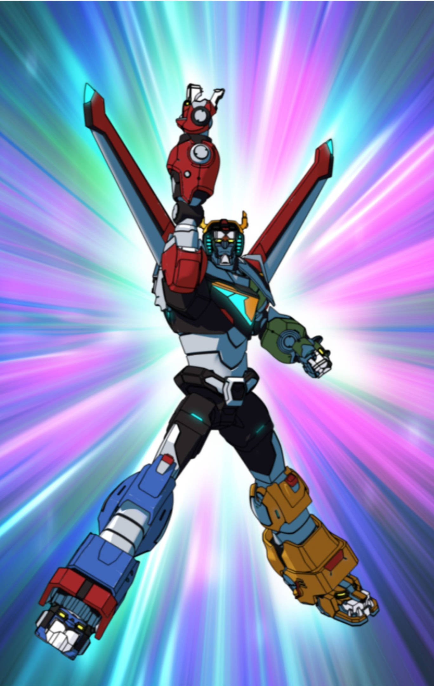

# How?
$web-only$
There are a few things that enable rust to deliver on its promises. The three we are going to cover in this section are mutability being at the type level, lifetimes and the borrow checker. Each of these play an important role individually but together they form a sort of safety Voltron. 
$web-only-end$

- Mutability at the type level
- Ownership & Borrowing
- Lifetimes

